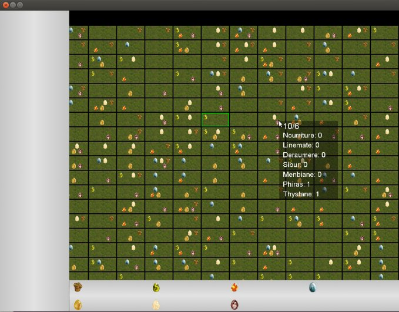

Zappy
=====

Zappy is an Automate game with a Graphic client and many IA's developed in cpp and a server developed in C.

Usage
=====

1. run the server (./server -n "team_name 1" "team_name 2" ..)
2. run a client and tons of IA's (./IA team_name)
3. watch ^.^

